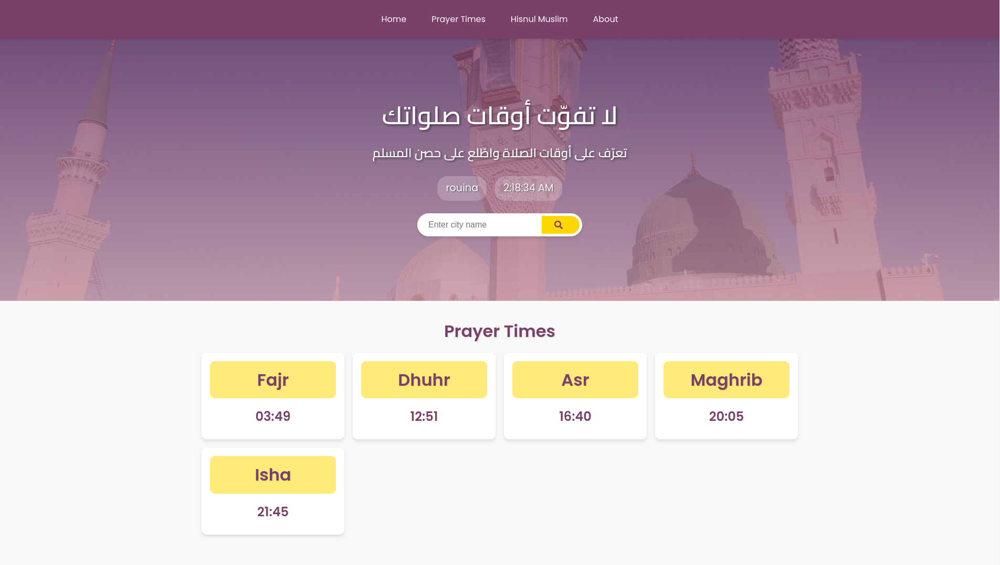

# Prayer Times Application

This application provides real-time prayer times based on the user's location.

## Features

- Real-time clock
- Displays prayer times for Fajr, Dhuhr, Asr, Maghrib, and Isha
- Allows user to search for their city

## How to Use

1. Open the application in your web browser.
2. Use the search bar to enter your city name.
3. The application will display the prayer times for your location.

## Code Overview

The main JavaScript file, `script.js`, contains the logic for the application. It uses the `Date` object to get the current time and updates the displayed time every second. The prayer times are fetched from DOM elements with specific IDs.

## Future Improvements

- Add support for different time zones
- Improve the search functionality to support more locations
- add hisn Al-muslim
- add multiple athan
- add some animation and visuals

## Contributing

Contributions are welcome! Please open an issue or submit a pull request.

